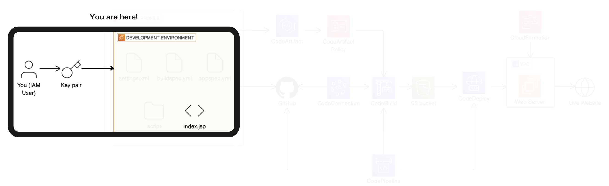
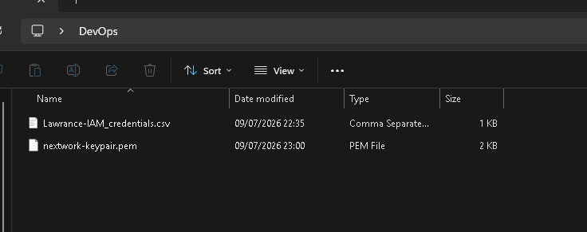
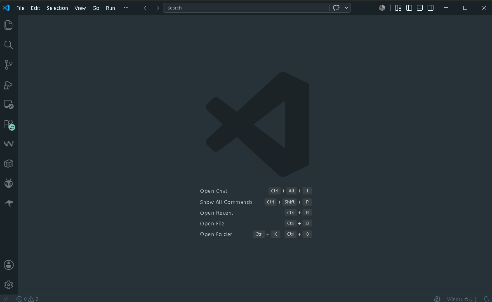
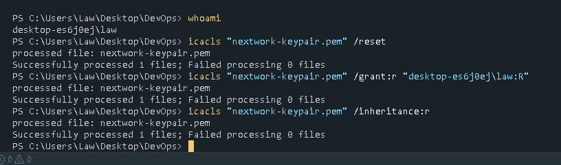
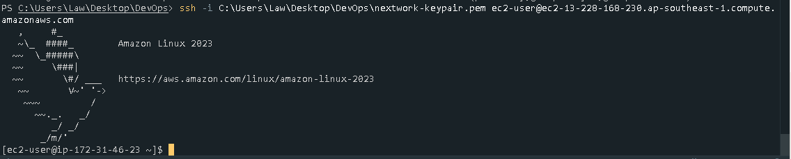
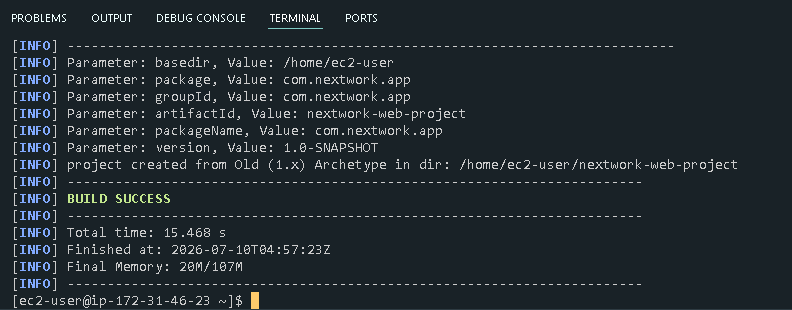
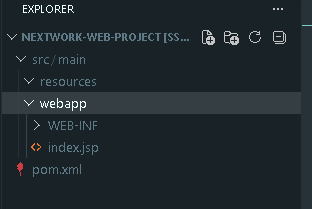
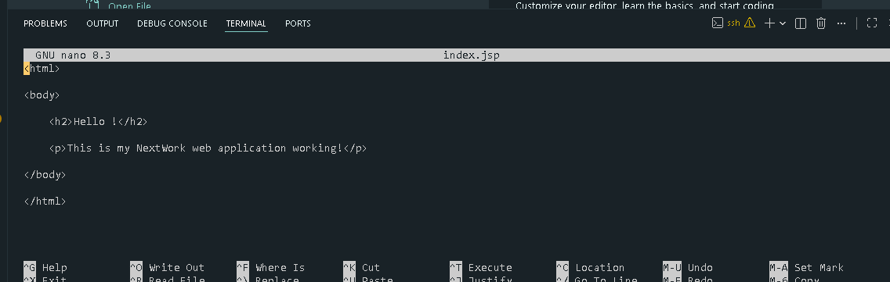
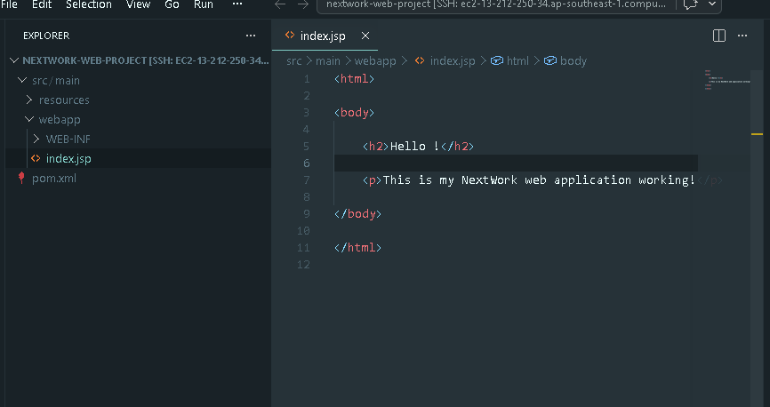

# Day 1: Set Up a Web App Using AWS and VS Code

> Part of a 6-day AWS DevOps Challenge, building a full CI/CD pipeline from source to deployment.
> **Next up:** Day 2, connecting the remote development environment to GitHub.

## Overview

A local machine can't safely hold the credentials and build tools a team's CI/CD pipeline depends on, and coding directly on a server through a bare terminal doesn't scale either. This project sets up a remote, cloud-based development environment on EC2, secured with a dedicated key pair and IP-restricted SSH, then connects it to VS Code over Remote-SSH so the server can be developed against like a local machine.

**Highlights:**
- Diagnosed and fixed an EC2 instance that hung and dropped its SSH connection during the Java install, caused by the `t3.micro`'s limited memory, by provisioning a swap file
- Went beyond the guided steps by editing the app directly through the terminal with `nano` instead of the VS Code GUI, to practice an IDE-less workflow

**Services used:** Amazon EC2, IAM
**Key concepts:** remote development with VS Code Remote-SSH, securing private keys on Windows with `icacls`, Java and Apache Maven for a cloud-built web application

## Architecture



This project sits at the very start of a larger pipeline that ends with a deployed live website on EC2 behind a VPC. Day 1 covers the **development environment stage**, highlighted above: an IAM user generates a key pair, which unlocks a development environment holding the project's configuration files (`settings.xml`, `buildspec.yml`, `appspec.yml`) and the web app source (`index.jsp`).

## How It Works

**EC2 Instance & Secure SSH Access**

The project starts with an EC2 instance to host the Java web app and its build tools. SSH access was restricted to my own IP address so I'm the only one who can log in and manage the instance. AWS generated a key pair for authentication, a public key held by AWS and a private key (`nextwork-keypair.pem`) downloaded locally, which I moved into a dedicated DevOps folder alongside my IAM credentials for safekeeping.



**VS Code & Remote-SSH Setup**

With the instance running, I installed VS Code and the Remote-SSH extension so I could browse, edit, and run commands on the EC2 server directly from the IDE instead of a bare terminal.



Before connecting, the private key needed locking down. From a terminal in the DevOps folder, I ran Windows `icacls` commands to strip inherited permissions, remove public access, and grant read-only access to just my own Windows user, since SSH refuses to use a key with overly permissive access.



With permissions set, I connected with `ssh -i <path-to-pem> ec2-user@<public-dns>`, using the instance's IPv4 DNS to resolve its address.



**Installing Java & Maven, Generating the App**

Apache Maven is a build automation tool that downloads dependencies and lays out a project from templates, and it needs a Java runtime to execute. I installed both on the instance, then ran `mvn archetype:generate` with a custom `artifactId` and `groupId` to scaffold a standard Java web app directory structure.



The generated project has two key folders: `src`, holding the Java source and configuration files, and `webapp`, holding front-end assets like `index.jsp`.



**Editing the App via Remote-SSH**

With the SSH config pointed at the instance's public IP, `ec2-user`, and the `.pem` key path, I connected VS Code to the instance through Remote-SSH and opened `index.jsp` in the editor, replacing the starter markup with a custom greeting and saving it straight back to the EC2 instance.

## Challenges & Fixes

**EC2 disconnected during the Java install**

- **Problem:** Partway through installing Java, the SSH session stopped responding, hung for a while, then dropped with a connection timeout.
- **Diagnosis:** The instance is a `t3.micro`, confirmed against `free -h` at 912Mi of usable RAM. That's little headroom for a package install, and the symptoms, a long hang followed by a timeout rather than a clean error, match the instance running out of memory and being unable to service the SSH handshake in time. Direct OOM log evidence didn't survive the session (logs had rotated by the time I went looking), but the instance type, the memory ceiling, and the symptom all line up with that explanation.
- **Fix:** Provisioned a 1 GB swap file to give the instance breathing room under memory pressure:

```bash
sudo dd if=/dev/zero of=/swapfile bs=1M count=1024
sudo chmod 600 /swapfile
sudo mkswap /swapfile
sudo swapon /swapfile
free -h
```

  The install completed without further disconnects afterward.

## Extension: Editing the App via nano

Beyond the guided steps, I edited `index.jsp` a second time directly in the terminal with `nano` instead of the VS Code GUI, to practice modifying application files when a graphical IDE isn't available. After navigating to the `webapp` directory, I ran `nano index.jsp` to make the edit in place, then verified it by running `cat index.jsp` to print the file's contents back to the terminal.



Editing this way felt noticeably slower and less visual than the IDE, without syntax highlighting or a file tree to lean on. I'd reach for an IDE over `nano` for anything involving multiple files, debugging, or page design, and save direct terminal edits for quick, single-file changes on servers where a GUI isn't an option.

## Result



The EC2 instance is now a working, securely accessible development environment: Java and Maven installed, a scaffolded web app in place, and `index.jsp` editable either through VS Code over Remote-SSH or directly in the terminal.

## Reflection & Next Steps

This project took about 120 minutes, most of it spent tracking down the EC2 disconnects during the Java install. The most rewarding moment was seeing terminal edits made with `nano` sync instantly with the file tree in VS Code, proof that both paths were touching the same live server.

**Next up:** Day 2, connecting the remote development environment to GitHub.
