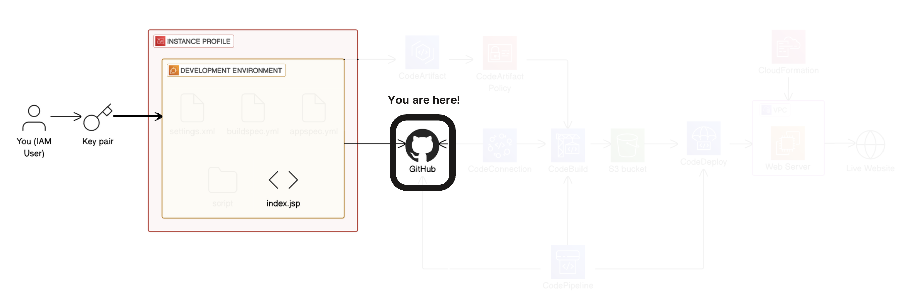
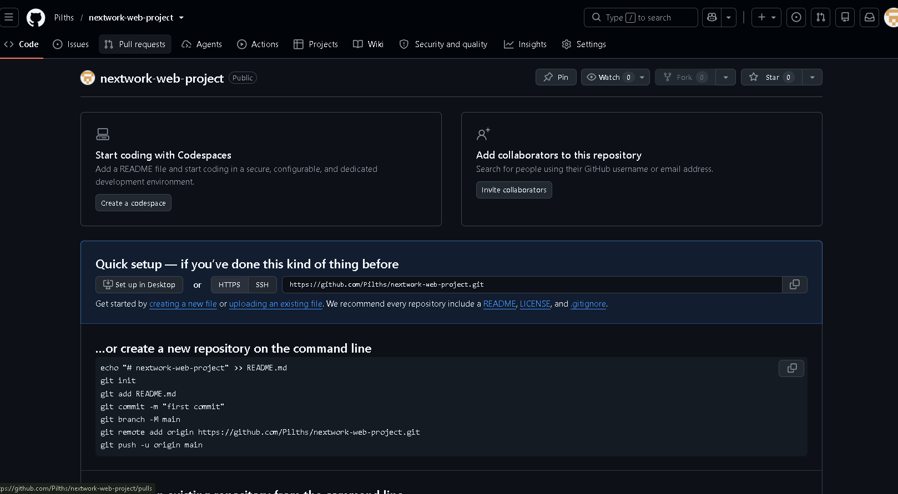
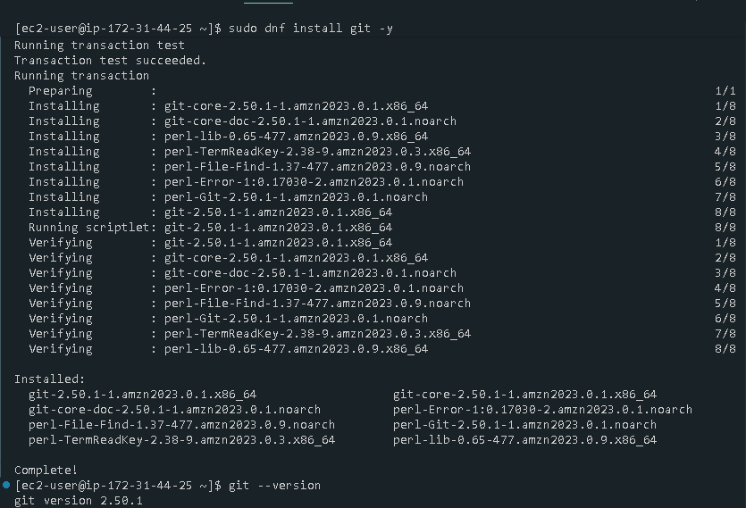
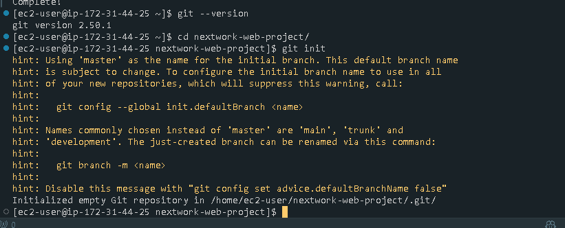
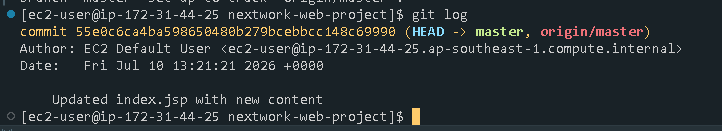
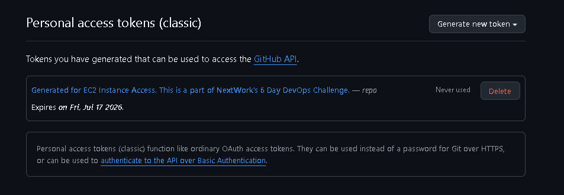
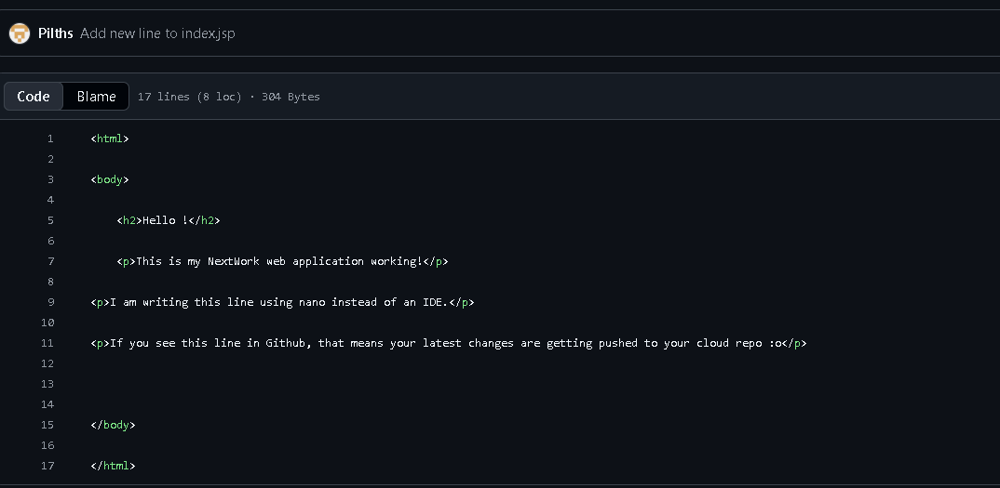
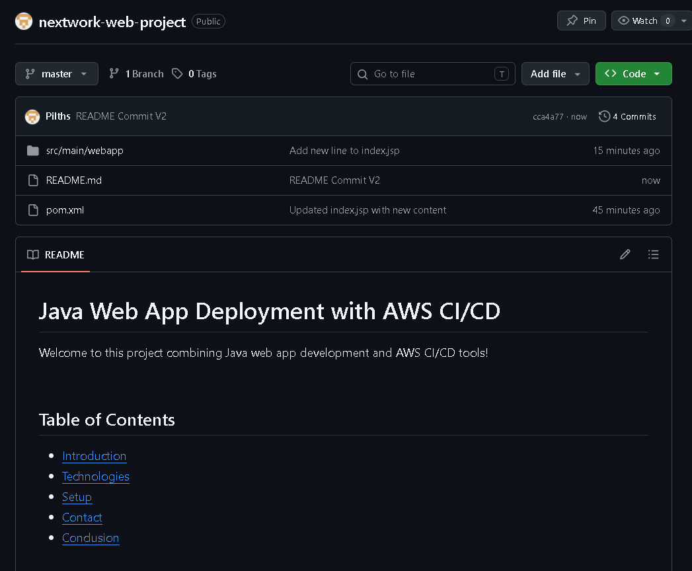

# Day 2: Connect a GitHub Repo with AWS

> Part of a 6-day AWS DevOps Challenge, building a full CI/CD pipeline from source to deployment.
> **Next up:** Day 3, Secure Packages with CodeArtifact

## Overview

Code that only exists on a single EC2 instance has no history, no backup, and no way for a pipeline to pull from it later. This project puts the web app from Day 1 under version control and connects it to a remote GitHub repository, so every change is tracked locally with Git and pushed to a source of truth the rest of the CI/CD pipeline can build from.

**Highlights:**
- Diagnosed and fixed a GitHub push rejected by password authentication, since deprecated for HTTPS, by generating a scoped Personal Access Token
- Verified the full local-to-remote sync loop by editing the app a second time, pushing with the token, and confirming the change landed on GitHub before documenting the project with a six-section README

**Services used:** Amazon EC2, GitHub, VS Code
**Key concepts:** initializing local Git repositories, staging and committing changes, upstream tracking branches, Personal Access Token authentication, Markdown READMEs

## Architecture

This project sits right after the development environment from Day 1. Day 2 covers the **GitHub stage**, highlighted above: the `index.jsp` source file living in the EC2 development environment gets committed to Git and pushed to GitHub, where it becomes available to later stages like CodeConnections and CodeBuild.

## How It Works

**Installing Git & Creating the GitHub Repo**

Git needed to be installed on the EC2 instance before it could track anything. I ran `sudo dnf update -y` and `sudo dnf install git -y`, then confirmed the install with `git --version`.

On the GitHub side, I created a new empty repository, `nextwork-web-project`, to act as the remote destination for the code.

**Initializing the Local Repository**

Back on the EC2 instance, I ran `git init` inside `/home/ec2-user/nextwork-web-project` to turn the folder into a Git repository. Git responded with a hint about `master` being used as the default branch name.

**Staging, Committing, and Pushing**

Publishing the first version of the code to GitHub took three commands: `git add .` to stage every file into Git's staging area, `git commit -m "<message>"` to save that staged snapshot with a description, and `git push -u origin master` to push it to GitHub. The `-u` flag sets the upstream tracking branch, linking local `master` to GitHub's so future pushes only need a plain `git push`. Running `git log` afterward confirmed the commit was recorded, with its hash, author, date, and message.

**Authenticating with a Personal Access Token**

Once the code changed again, pushing asked for credentials, and typing in the GitHub account password failed. GitHub deprecated password authentication for HTTPS operations, so a Personal Access Token is required instead. I generated a classic token from GitHub's Developer Settings, scoped to `repo`, with a 7-day expiration, and used it in place of a password at the next push prompt.

**Making Changes Again**

To see the whole loop work end to end, I edited `index.jsp` in VS Code again, adding a line noting the edit was made to verify the push pipeline. Saving in VS Code only updates the file on the EC2 instance, the change doesn't reach GitHub until it's staged, committed, and pushed, so I ran `git add .`, `git commit`, and `git push`, authenticating with the Personal Access Token, and confirmed the new line was visible on GitHub's side.

**Documenting with a README**

As a finishing touch, I added a `README.md` file to the repository, written in Markdown, covering the project overview, prerequisites, Git installation, repository initialization, token-based authentication setup, and resource deletion instructions. It was staged, committed, and pushed the same way as any other change.

## Challenges & Fixes

**GitHub push rejected by password authentication**
- **Problem:** Pushing to GitHub prompted for credentials, and entering the account password was rejected.
- **Diagnosis:** GitHub deprecated password-based authentication for HTTPS Git operations to close off a common attack vector, so a password alone can no longer authenticate a push.
- **Fix:** Generated a classic Personal Access Token from GitHub Developer Settings, scoped to `repo` with a 7-day expiration, and used it in place of the password. The push succeeded immediately after.

## Result

The web app's source code now lives in a GitHub repository with a full commit history, an upstream-tracked branch, token-based push authentication, and a README documenting how to reproduce the setup, ready for the pipeline stages that build on it.

## Reflection & Next Steps

This project took about 120 minutes, most of it spent working through Personal Access Token authentication after the password push was rejected. The most rewarding moment was watching a local edit sync to GitHub within seconds of running `git push`.

**Next up:** Day 3, Secure Packages with CodeArtifact
