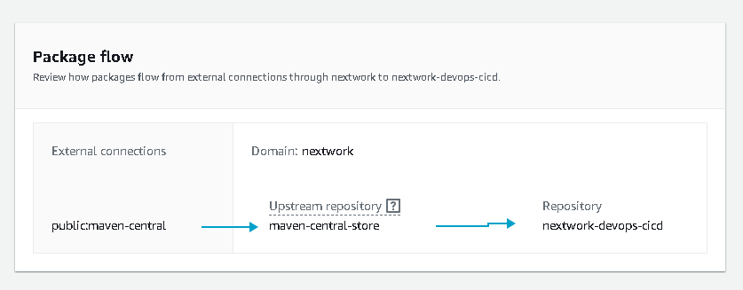
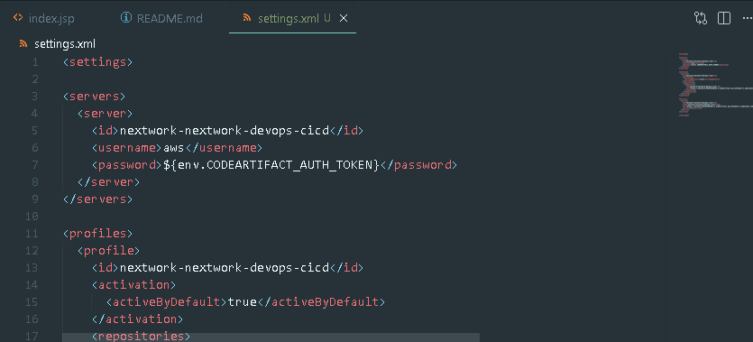
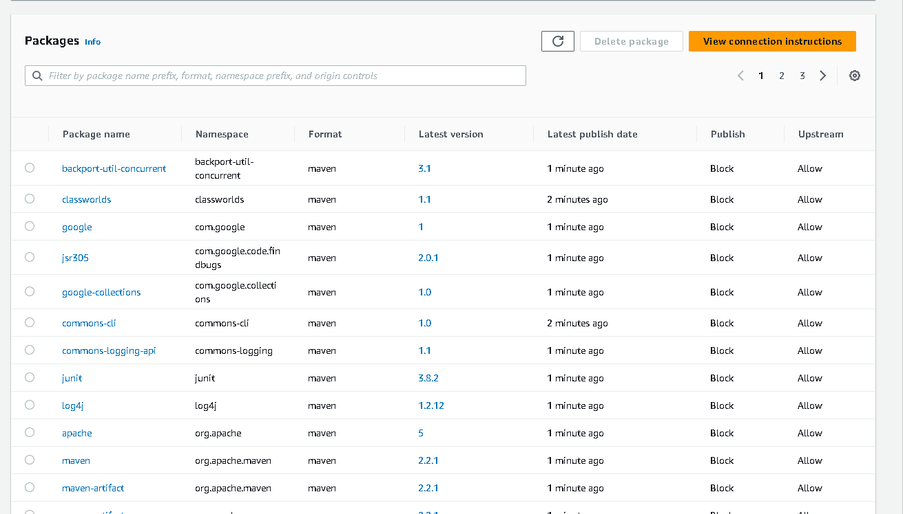
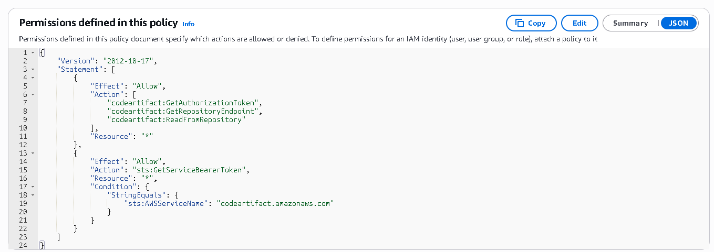
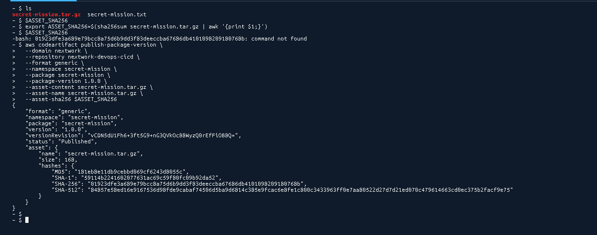

# Day 3: Secure Packages with CodeArtifact

> Part of a 6-day AWS DevOps Challenge — building a full CI/CD pipeline from source to deployment.
> **Next up:** Day 4 — Continuous Integration with CodeBuild

## Overview

Pulling dependencies straight from public repositories at build time is a security risk — no control over what gets cached, no audit trail, no way to enforce least-privilege access. This project sets up AWS CodeArtifact as a private, secure package repository so builds fetch Java dependencies through a controlled, permissioned path instead.

**Highlights:**
- Diagnosed and fixed an IAM permission gap that blocked the build server from retrieving CodeArtifact tokens
- Went beyond the base setup to publish a custom package to the private repository, complete with a generated checksum for integrity verification

**Services used:** AWS CodeArtifact, AWS IAM, Amazon EC2
**Key concepts:** securing packages with upstream repositories, configuring `settings.xml`, temporary IAM roles instead of hardcoded credentials

## How It Works

**Repository & Domain**

CodeArtifact is a secure, central service for storing packages — engineering teams use artifact repositories to keep builds reliable, prevent security risks from public downloads, and keep package versions consistent. A **domain** groups multiple repositories under one set of security controls; this domain (`nextwork`) centralizes permissions and package sharing across the whole pipeline. The repository's **upstream** is Maven Central, which CodeArtifact checks and caches from whenever a package isn't already stored locally.

**Maven & CodeArtifact**

`settings.xml` configures Maven to locate the private CodeArtifact repository, authenticate with a temporary authorization token, and route all dependency requests through the secure domain instead of hitting public repositories directly.

**Verifying the Connection**

After compiling with `settings.xml` in place, the CodeArtifact console showed the repository populated with Maven packages — confirming CodeArtifact successfully pulled and cached dependencies from Maven Central rather than the build reaching the public internet directly.

## Challenges & Fixes

**Build server couldn't retrieve a CodeArtifact authorization token**
- **Problem:** Accessing CodeArtifact requires an authorization token to authenticate build tools. Retrieving that token failed.
- **Diagnosis:** The EC2 instance had no IAM permissions to connect to CodeArtifact by default — there was no role granting it that access.
- **Fix:** Created an IAM policy granting `codeartifact:GetAuthorizationToken`, `codeartifact:GetRepositoryEndpoint`, and `codeartifact:ReadFromRepository`, plus `sts:GetServiceBearerToken` scoped to CodeArtifact. Attached the policy to a new IAM role and associated that role with the EC2 instance — using a role instead of hardcoded keys means AWS handles credential rotation automatically.

## Extension: Publishing a Custom Package

Beyond the base setup, I configured Maven to publish a custom artifact to the private repository — useful when teams need to share proprietary internal libraries without pushing them to a public registry. I compressed the custom files into a tarball, generated a SHA-256 checksum so the pipeline can verify package integrity on download, then used the AWS CLI to publish the package to CodeArtifact with its content, name, and hash attached.

## Result

Checking the CodeArtifact console confirmed the custom package listed under its own name and version — proof the publishing pipeline works end-to-end, not just for pulling public dependencies but for privately distributing internal ones too.

## Reflection & Next Steps

This project took about 120 minutes. The most challenging part was configuring local Maven files to authenticate with the temporary AWS token. The most rewarding moment was publishing a custom package and seeing it cached inside AWS.

**Next up:** Day 4 — Continuous Integration with CodeBuild
