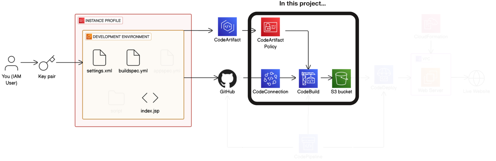
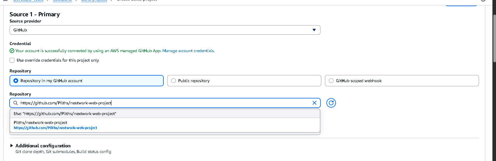
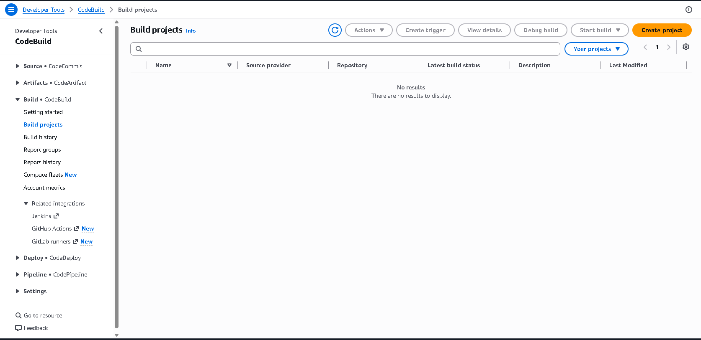
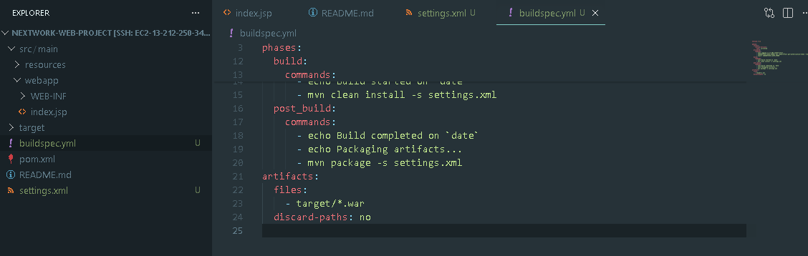
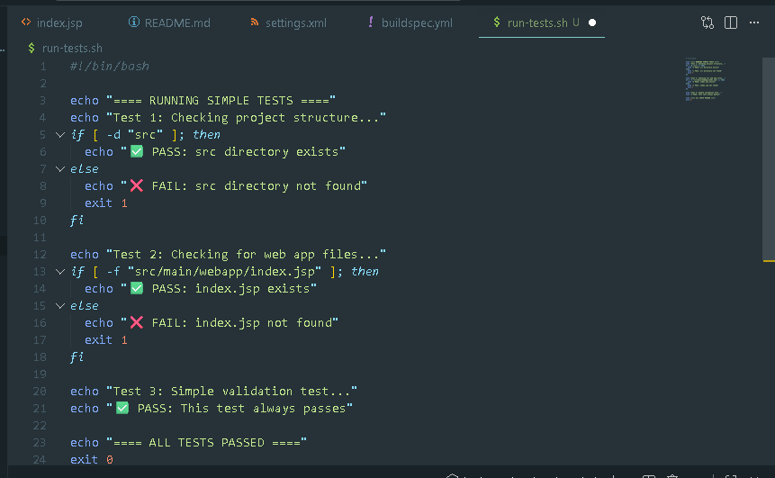
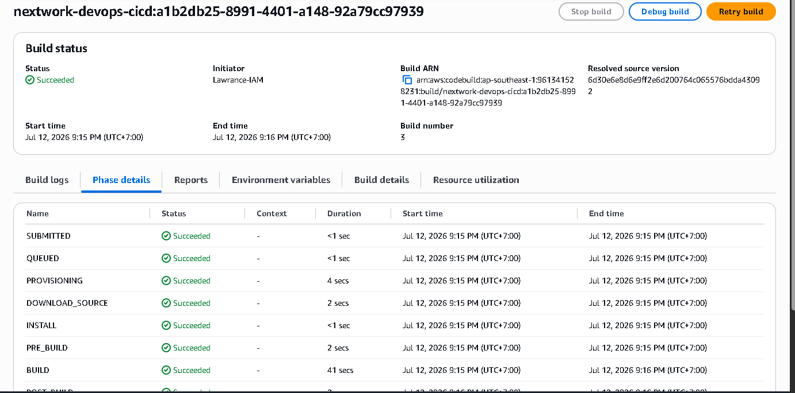

# Day 4: Continuous Integration with CodeBuild

> Part of a 6-day AWS DevOps Challenge — building a full CI/CD pipeline from source to deployment.
> **Next up:** Day 5 — Deploy a Web App with CodeDeploy

## Overview

Manual builds are slow and error-prone — a single missed step can ship broken code to production. This project automates compiling, testing, and packaging on every push using AWS CodeBuild, so bad code never reaches deployment.

**Highlights:**
- Diagnosed and fixed two separate build failures (missing build config, then an IAM permission gap)
- Added an automated security-scan gate beyond the base requirements, checking for hardcoded secrets before every build

**Services used:** AWS CodeBuild, Amazon S3, AWS CodeArtifact
**Key concepts:** continuous integration, `buildspec.yml` configuration, IAM role permissions

## Architecture



This project sits inside a larger pipeline that starts with an IAM user pushing code through a development environment to GitHub, and ends with a deployed live website on EC2 behind a VPC. Day 4 covers the **build stage**, highlighted above: authenticating with **CodeArtifact** through a scoped IAM policy, connecting to the repo via **CodeConnections**, compiling and packaging the app in **CodeBuild**, and storing the resulting artifact in an **S3 bucket**.

## How It Works

**Source & Connection**

CodeBuild pulls from GitHub, connected through AWS CodeConnections rather than a personal access token. I used GitHub App as the credential type because it's the most secure option and eliminates the operational effort of manual token rotation. CodeConnections acts as a secure, managed bridge that handles authentication, removing the need to manage fragile tokens or passwords.



**Build Environment & Artifacts**

The build runs in an on-demand EC2 container using a Corretto 8 runtime image to compile the Java web app. The output is a WAR file — the physical artifact containing everything needed to run the application — packaged as a Zip for faster S3 uploads and lower storage costs, and stored in an S3 bucket. CloudWatch Logs is enabled to capture build commands and output for troubleshooting.



**buildspec.yml**

This file is the recipe CodeBuild executes: prepare the runtime and authenticate with AWS CodeArtifact, compile the code, then package the WAR file into S3.



## Challenges & Fixes

**1. Build failed — missing configuration file**
- **Problem:** The first build failed immediately.
- **Diagnosis:** CodeBuild couldn't find a `buildspec.yml` — without it, there's no recipe telling CodeBuild what to run.
- **Fix:** Added a `buildspec.yml` defining the install, build, and packaging phases.

**2. Build failed — dependency resolution error**
- **Problem:** The second build progressed further, then failed during dependency resolution.
- **Diagnosis:** The CodeBuild service role didn't have permission to pull Maven packages from CodeArtifact.
- **Fix:** Granted the CodeBuild IAM role read access to CodeArtifact. The next build compiled and packaged successfully.

## Extension: Automated Security Scanning

Beyond the base project, I added a test script to the `pre_build` phase that scans repository files for hardcoded secrets, keys, or credentials before compilation begins — catching accidental credential leaks before they reach a build artifact.

```bash
#!/bin/bash

echo "==== RUNNING SIMPLE TESTS ===="
echo "Test 1: Checking project structure..."
if [ -d "src" ]; then
  echo "✅ PASS: src directory exists"
else
  echo "❌ FAIL: src directory not found"
  exit 1
fi

echo "Test 2: Checking for web app files..."
if [ -f "src/main/webapp/index.jsp" ]; then
  echo "✅ PASS: index.jsp exists"
else
  echo "❌ FAIL: index.jsp not found"
  exit 1
fi

echo "Test 3: Simple validation test..."
echo "✅ PASS: This test always passes"

echo "==== ALL TESTS PASSED ===="
exit 0
```



Pushed to GitHub to trigger the pipeline — the AWS console showed the Source, Build, and Deploy stages all transition to green, confirming the CI/CD pipeline successfully automated the release process.

## Result



The artifact landed in S3: a clean, deployable WAR file, produced automatically on every push.

## Reflection & Next Steps

This project took about 150 minutes, most of it spent debugging the two failures above. The most rewarding moment was seeing the first successful compile produce a clean, zipped S3 artifact.

**Next up:** Day 5 — Deploy a Web App with CodeDeploy
