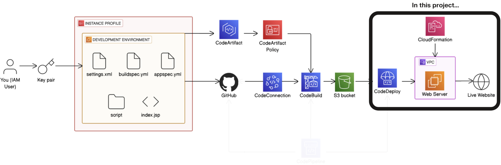
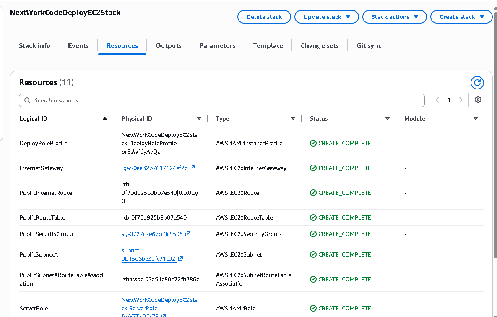
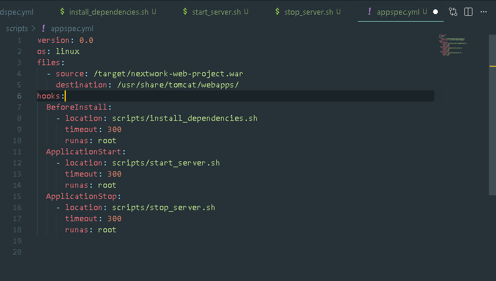
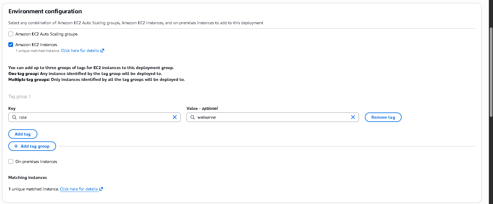
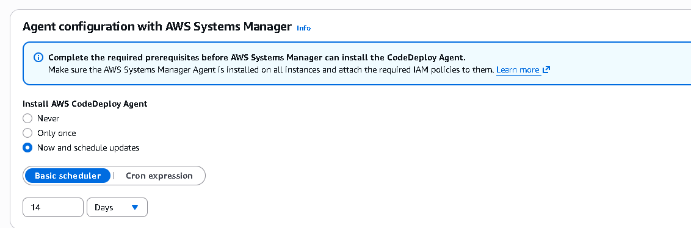
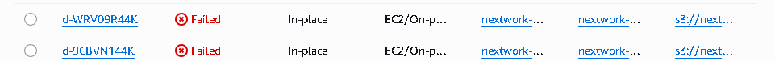

# Day 5: Deploy a Web App with CodeDeploy

> Part of a 6-day AWS DevOps Challenge, building a full CI/CD pipeline from source to deployment.
> **Next up:** Day 6, Set Up Your Pipeline with AWS CodePipeline

## Overview

A compiled build artifact sitting in S3 does nothing on its own. This project automates the last mile of the pipeline: taking the WAR file CodeBuild produces and installing it on a live production EC2 instance with AWS CodeDeploy, using CloudFormation to provision the target infrastructure and lifecycle hook scripts to orchestrate the rollout.

**Highlights:**
- Diagnosed and fixed seven distinct failures across the build, script, and OS layers (a CodeArtifact region mismatch, non-executable scripts, a missing `appspec.yml`, a missing CodeDeploy agent, a "ghost instance" retry bug, and a Tomcat package mismatch) before the pipeline went green
- Discovered mid-project that the production server is deliberately provisioned without an SSH key pair, and used AWS Systems Manager Session Manager for keyless troubleshooting instead
- Hardened `install_dependencies.sh` with defensive scripting (`set -euo pipefail`, dynamic package manager detection, privilege checks) beyond the provided template

**Services used:** AWS CodeDeploy, AWS CloudFormation
**Key concepts:** immutable infrastructure, deployment lifecycle hooks, keyless production access via Systems Manager, cross-platform script troubleshooting (line endings and execute permissions)

## Architecture

This project sits inside the same CI/CD pipeline as previous days. Day 5 covers the deployment stage highlighted above: CloudFormation provisions a VPC and production EC2 instance ahead of time, and CodeDeploy pulls the packaged WAR file from the S3 bucket that CodeBuild produces and installs it onto the live web server.

## How It Works

**Deployment Environment**

CloudFormation provisions the entire production target in one stack: a VPC, subnet, route tables, an internet gateway, a security group, and the EC2 instance itself. Deleting the stack tears every resource down in the correct order, avoiding orphaned charges. The template deliberately launches the instance without an SSH key pair, an immutable infrastructure design where nobody logs into production directly (more on how I discovered this in Challenges & Fixes).

**Deployment Scripts and appspec.yml**

Three lifecycle scripts orchestrate the rollout: `install_dependencies.sh` installs Apache and Tomcat during the `BeforeInstall` hook, `start_server.sh` starts both services during `ApplicationStart`, and `stop_server.sh` uses `pgrep` to check whether Tomcat or Apache is already running before attempting to stop them, so the script doesn't fail on a fresh instance with nothing to stop. `appspec.yml` ties it together: the `files` section maps the compiled WAR into Tomcat's webapps directory, and `hooks` schedules the three scripts against CodeDeploy's lifecycle events.

**Setting Up CodeDeploy**

A CodeDeploy application groups the deployment configuration, and the deployment group defines where and how to deploy. I targeted instances by the tag `role: webserver` rather than a hardcoded instance ID, so any future instance carrying that tag is picked up automatically. Deployment configuration was `CodeDeployDefault.AllAtOnce`, appropriate for a single-instance lab. I also set the deployment group to install and auto-update the CodeDeploy agent through Systems Manager going forward, so a fresh instance never launches without one again.

**Running a Deployment**

The revision location points at the zipped build artifact's S3 URI, the same artifact CodeBuild produces. Once triggered, CodeDeploy downloads the ZIP, unpacks it on the production instance, and runs through the `BeforeInstall`, `ApplicationStart`, and `ApplicationStop` hooks in order.

## Challenges & Fixes

**1. Build failed with an Unauthorized error fetching Maven plugins**
- **Problem:** `mvn -s settings.xml -DskipTests package` failed with `Unauthorized` while fetching `maven-surefire-plugin` from CodeArtifact, so no fresh artifact reached S3 for CodeDeploy to use.
- **Diagnosis:** `buildspec.yml`'s token request defaulted to the `us-east-2` region while the CodeArtifact domain actually lived in `ap-southeast-1`, and the environment variable name didn't match exactly between `buildspec.yml` and `settings.xml`.
- **Fix:** Added `--region ap-southeast-1` to the `aws codeartifact get-authorization-token` command and aligned the `CODEARTIFACT_AUTH_TOKEN` variable name in both files.

**2. Deployment crashed instantly with an UnknownError**
- **Problem:** Deployments failed in zero seconds without showing any lifecycle events.
- **Diagnosis:** `appspec.yml` was nested inside the `scripts/` folder. CodeDeploy only looks for it at the repository root.
- **Fix:** Moved `appspec.yml` to the repository root, next to `pom.xml` and `buildspec.yml`.

**3. BeforeInstall failed, first at zero seconds, then after hanging**
- **Problem:** The `BeforeInstall` hook failed instantly on some runs and hung for the full 5-minute timeout on others.
- **Diagnosis:** Reading `/var/log/aws/codedeploy-agent/codedeploy-agent.log` over Session Manager (the deployment-specific `scripts.log` didn't exist yet, since the scripts never launched) turned up two compounding issues: the scripts were pushed from Windows without the executable bit, since Git on Windows doesn't preserve `chmod +x`, and they were saved with CRLF line endings, which Linux reads as part of the shebang line and rejects as a bad interpreter.
- **Fix:** Ran `git update-index --chmod=+x` on all three scripts and converted their line endings to LF in VS Code before pushing again.

**4. Couldn't reach the production instance to debug it**
- **Problem:** SSH to the production server first timed out, then returned `Permission denied (publickey)`.
- **Diagnosis:** I initially assumed a security group or Windows key-permission issue, but the EC2 console's Key pair column showed a dash: no key pair at all. The CloudFormation template deliberately launches production without one.
- **Fix:** Used AWS Systems Manager Session Manager for keyless, browser-based terminal access instead of SSH.

**5. CodeDeploy agent was never installed**
- **Problem:** `sudo systemctl status codedeploy-agent` returned `Unit codedeploy-agent.service not found`, and deployments hung in `Pending` indefinitely.
- **Diagnosis:** The CloudFormation-launched instance never bootstrapped the agent.
- **Fix:** Installed it manually over Session Manager (`yum install -y ruby wget`, downloaded the `ap-southeast-1` regional install package, `chmod +x ./install`, `sudo ./install auto`), then enabled and started the service.

**6. Retry deployment kept failing even with a healthy agent**
- **Problem:** Clicking Retry deployment failed instantly, even though the agent's own log showed it polling AWS successfully every 45 seconds.
- **Diagnosis:** The Retry button re-targets the exact instance ID from the previous run. My earlier instance had been terminated and replaced, so CodeDeploy kept trying to reach a dead server instead of re-evaluating the `role: webserver` tag.
- **Fix:** Stopped the stuck deployment and used Create deployment from the deployment group instead, forcing a fresh tag lookup that found the running instance.

**7. Deployment succeeded, but the site returned a 503**
- **Problem:** The pipeline reported success, but visiting the public DNS returned `503 Service Unavailable`.
- **Diagnosis:** `install_dependencies.sh` installed a package named `tomcat9`, which doesn't exist on Amazon Linux 2 (the correct package is `tomcat`), so Tomcat never started.
- **Fix:** Corrected the package name and manually started the service with `sudo systemctl start tomcat`, which resolved it. (SELinux's `httpd_can_network_connect` policy can also block Apache from reaching Tomcat on port 8080 and is worth checking if a 503 persists after Tomcat is confirmed running.)

## Extension: Reasoning Through Automatic Rollbacks

Beyond the base project, I explored CodeDeploy's rollback behavior as this project's extension. I enabled automatic rollbacks on the deployment, then reasoned through what happens if `start_server.sh` fails: an intentional typo, like misspelling the service name so `systemctl start tomcat` fails, returns a non-zero exit code. CodeDeploy intercepts that during `ApplicationStart`, halts the rollout, and marks it failed. With rollbacks enabled, it redeploys the last known-good revision from S3 automatically, keeping the site online without manual intervention. In a real production environment, I'd pair this with CloudWatch Alarms watching 5xx rates and host health, triggering the same rollback the moment a bad deploy starts affecting live traffic.

## Result

I verified the deployment by visiting the production EC2 instance's public DNS over HTTP and confirming the Java web app's homepage loaded, proof that CodeDeploy had pulled the WAR file from S3 and installed it correctly end to end.

## Reflection & Next Steps

This project took about 5 hours, most of it spent working through the `BeforeInstall` failures above, from line endings and permissions to a missing agent and a package name mismatch. Seeing the live Java homepage load after clearing every one of those blockers was the most rewarding part.

**Next up:** Day 6, AWS CodePipeline, connecting CodeBuild and CodeDeploy into a single pipeline triggered by a git push.
