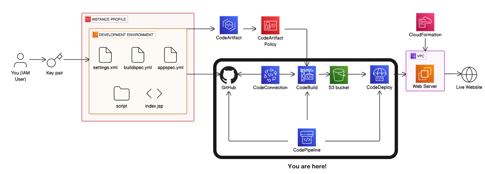
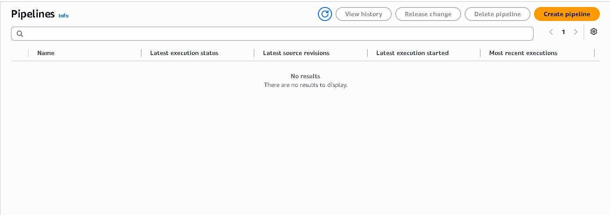
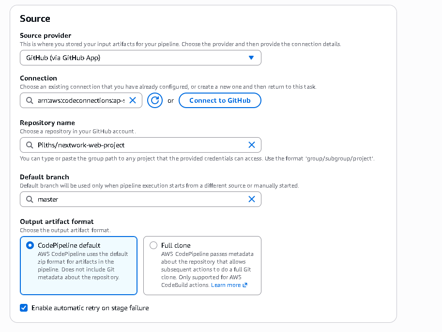
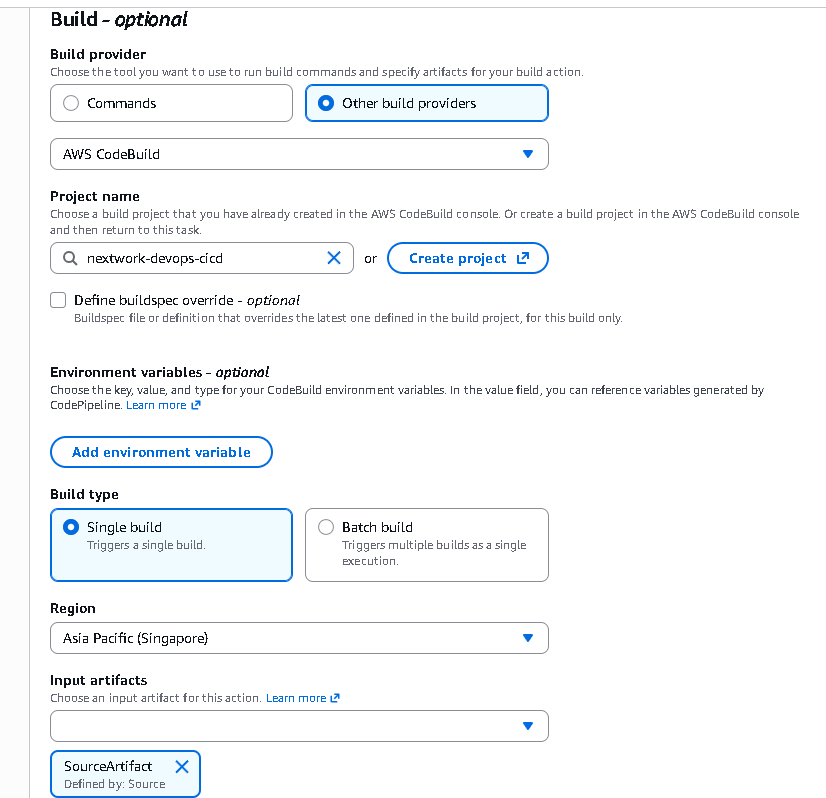
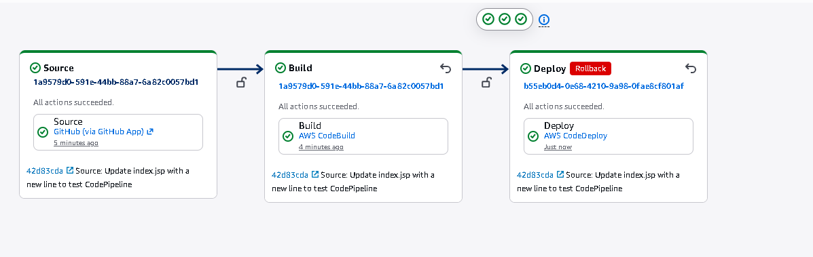
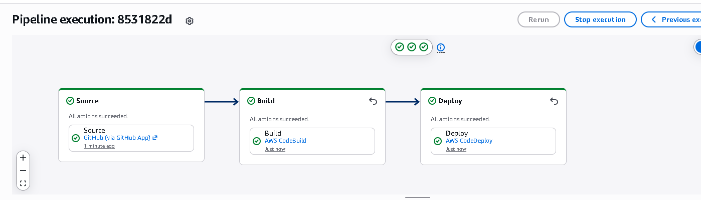
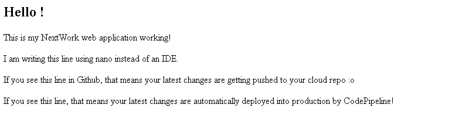

# Day 6: Set Up Your Pipeline with AWS CodePipeline

> Part of a 6-day AWS DevOps Challenge, building a full CI/CD pipeline from source to deployment.
> This is the final project in the series.

## Overview

Up to this point, every stage of the pipeline ran on its own: a manual build in CodeBuild, then a manual deployment in CodeDeploy. This project ties both stages together into a single AWS CodePipeline, so a `git push` compiles, packages, and deploys the app end to end with no manual steps in between.

**Highlights:**
- Wired GitHub, CodeBuild, and CodeDeploy into one three-stage pipeline (Source, Build, Deploy) triggered automatically by a GitHub webhook
- Verified the automation end to end with a live `git push`, watching CodePipeline detect the commit and deploy it with zero manual intervention
- Intentionally triggered a rollback as an extension, confirming CodeDeploy redeploys the last good build straight from S3, skipping Source and Build entirely

**Services used:** AWS CodePipeline, AWS CodeBuild, AWS CodeDeploy, Amazon S3
**Key concepts:** CI/CD orchestration, stage boundaries, GitHub webhooks, automatic rollback

## Architecture

This project sits inside the same CI/CD pipeline as previous days. Day 6 covers the orchestration layer highlighted above: AWS CodePipeline coordinates the whole flow from GitHub through CodeConnections, CodeBuild, the S3 artifact bucket, and CodeDeploy, so every push moves through build and deployment automatically instead of needing a manual trigger at each stage.

## How It Works

**Setting Up the Pipeline**

Before creating the pipeline, the CodePipeline console starts with an empty list of pipelines to configure from scratch. AWS CodePipeline generates a service role automatically during setup, giving it the IAM permissions it needs to fetch source code, trigger builds, and deliver artifacts to CodeDeploy on my behalf. I set the execution mode to Superseded, so a new commit always takes priority over an in-progress run of an older one, rather than Queued (sequential) or Parallel (concurrent).

**Source Stage**

The Source stage connects to GitHub through GitHub App rather than a personal access token, watching the `master` branch. Enabling webhook events means any push to that branch fires an instant notification that starts the pipeline, rather than CodePipeline having to poll GitHub on a schedule.

**Build Stage**

The Build stage runs the existing `nextwork-devops-cicd` CodeBuild project from Day 4, taking `SourceArtifact` (the raw GitHub source ZIP) as its input and producing the compiled WAR package as output.

**Deploy Stage**

The Deploy stage hands the build output to the CodeDeploy application and deployment group from Day 5, which targets the production EC2 instance dynamically by tag, with rollback safety enabled.

## Extension: Testing Rollback Safety

Beyond the base project, I tested the pipeline's rollback behavior directly rather than just enabling the setting and moving on. After confirming the pipeline's normal flow worked end to end (a `git push` triggering all three stages automatically), I manually triggered a rollback on the CodeDeploy deployment group right after that deployment succeeded.

The pipeline view below shows exactly what a rollback does differently from a normal run: Source and Build still display their prior execution (shared ID, several minutes old), while Deploy carries a red "Rollback" badge with its own execution ID and a "Just now" timestamp. That confirms CodeDeploy skipped compilation entirely and redeployed the last known-good build straight from S3.

After the rollback finished, the live site reverted to its original `index.jsp` text, proof that the last verified build package was pulled and redeployed correctly.

## Result

I tested the finished pipeline by editing `index.jsp`, committing locally, and pushing to `master`. CodePipeline detected the push immediately and ran all three stages without any manual trigger.

Visiting the production EC2 instance's public IP afterward showed the new line rendering live on the page, confirming a zero-touch deployment from commit to production.

## Reflection & Next Steps

This project took about 3 hours. The most challenging part was CodeDeploy agent status and Apache boot configuration, the same territory covered in Day 5's troubleshooting, this time surfacing again while wiring the deployment stage into the pipeline. The most rewarding moment was watching a single `git push` trigger a complete, zero-touch deployment to production.

This closes out the 6-day AWS DevOps Challenge: from a manually configured EC2 instance on Day 1 to a fully automated CI/CD pipeline with build, deploy, and rollback all wired together.
